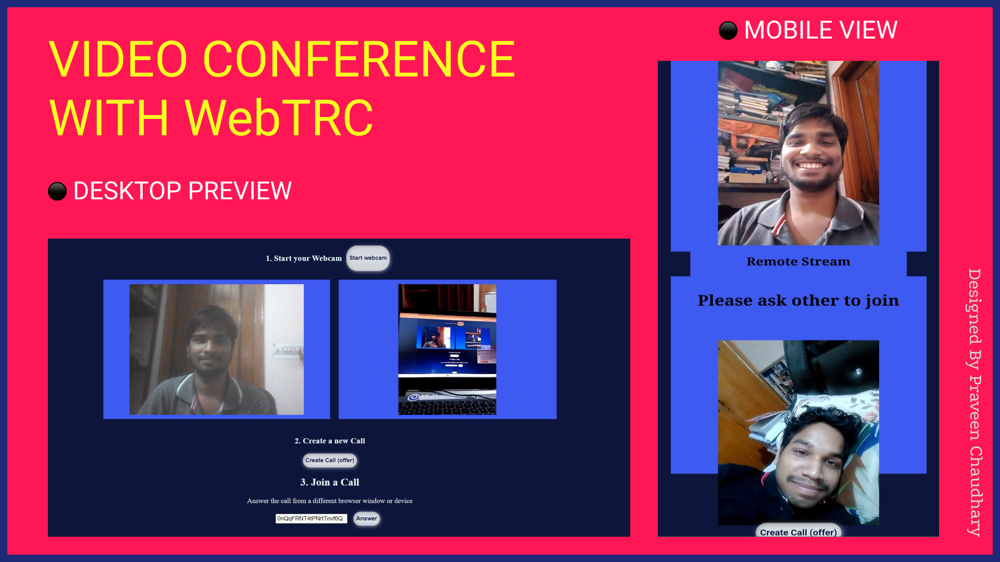

## Video Conferencing With WebRTC
This project uses the WebRTC with the minimal javascipt created using [Vite](https://vitejs.dev/) JS. We had used the google public stun server ,firstore as a signaling server and firebase as a hosting service.

#### Web Preview : - 

#### What is WebRTC : - 
WebRTC is a free, open-source project providing web browsers and mobile applications with real-time communication via simple application programming interfaces.

#### Features : - 
1. Great UI
2. Simple and less dependencies
3. Free stun server included already

#### How to setup up :- 
1. Install the dependencies using `npm install`
2. Add you firebase config in the `main.js` file.
3. Run the following command to run the server at localhost `npm run dev`

##### Hurray! Your video conference app is live.

##### Last Updated : - 
28 March 2021